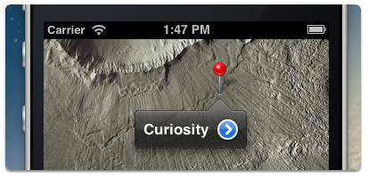

Overview
--------

SMCalloutView aims to be an exact replica of the private UICalloutView system
control.

We all love those "bubbles" you get when clicking pins in MKMapView. But
sadly, it's impossible to present this bubble-style "Callout" UI anywhere
outside MKMapView. Phooey! So this class _painstakingly_ recreates this handy
control for your pleasure.

Usage
-----

To use SMCalloutView in your own projects, simply copy the files
`SMCalloutView.h` and `SMCalloutView.m`.

SMCalloutView, by default, will render in the new style introduced with
iOS 7. If you need the old style, simply include `SMClassicCalloutView.h`
and `SMClassicCalloutView.m` in your project as well. There is a special
class constructor, `+[SMCalloutView platformCalloutView]` which will
automatically select the appropriate callout class for the current platform.

The comments in `SMCalloutView.h` do a lot of explaining on how to use the
class, but the main function you'll need is `presentCalloutFromRect:`. You'll
specify the view you'd like to add the callout to, as well as the rect
defining the "target" that the popup should point at. The target rect should
be _in the coordinate system of the target view_ (just like the similarly-
named `UIPopover` method). Most likely this will be `target.frame` if you're
adding the callout view as a sibling of the target view, or it would be
`target.bounds` if you're adding the callout view to the target itself.

You can study the included project's UIViewController subclasses for a working
example.

Questions
---------

#### How do I change the height of the callout?

If you use only the `title/titleView/subtitle/subtitleView` properties, the
callout will always be the "system standard" height. If you assign the
`contentView` property however, then the callout will size to fit the
`contentView` and the other properties are ignored.

  [#29]: https://github.com/nfarina/calloutview/issues/29

#### Can I customize the background graphics?

Yes, the callout background is an instance of `SMCalloutBackgroundView`. You
can set your own custom `View` subclass to be the background, or you can use
one of the built-in subclasses:

 - `SMCalloutMaskedBackgroundView` renders an iOS-7 style background.

 - `SMCalloutImageBackgroundView` lets you specify each of the image
   "fragments" that make up a horizontally-stretchable background.

 - `SMCalloutDrawnBackgroundView` draws the background at any size using
   CoreGraphics methods. You can copy the `-drawRect` method and change the
   parameters to suit your needs.

#### Can I use the callout with the Google Maps iOS SDK?

Check out [ryanmaxwell's demo project][googlemaps] for an example of one way
to do this. ([More discussion on this topic][#25])

  [googlemaps]: https://github.com/ryanmaxwell/GoogleMapsCalloutView
  [#25]: https://github.com/nfarina/calloutview/issues/25

#### Have you recreated more of MapKit? 

Nope, but other intrepid coders have!

- For an awesome replacement of the pulsing blue "Current Location" dot, check
  out [Sam Vermette's SVPulsingAnnotationView][dot].

- And for the outdoor map data and tiles themselves, check out [Mapbox's iOS
  SDK][mapbox], a complete open-source solution for custom maps. They even use
  `SMCalloutView` out of the box!

  [dot]: https://github.com/samvermette/SVPulsingAnnotationView
  [mapbox]: https://www.mapbox.com/mobile/

More Info
---------

You can read more info if you wish in the [blog post][].

  [blog post]: http://nfarina.com/post/78014139253/smcalloutview-for-ios-7

ARC Support
-----------

This class requires LLVM 4.0 with [Automatic Reference Counting
(ARC)](http://clang.llvm.org/docs/AutomaticReferenceCounting.html), enabled by
default in modern Xcode projects.
